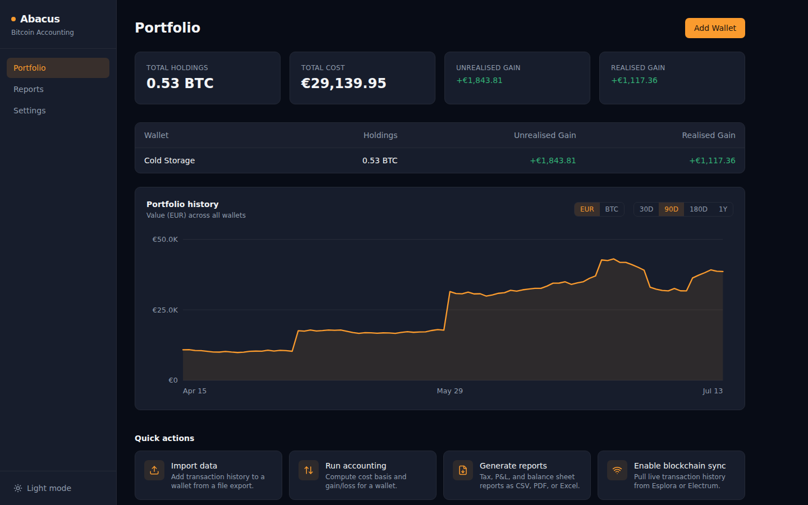
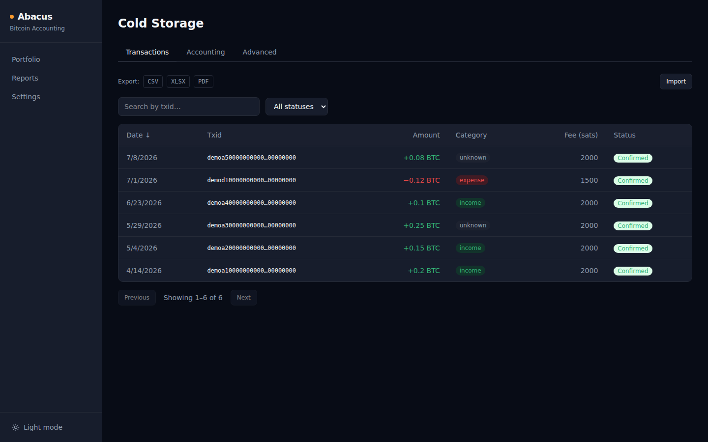
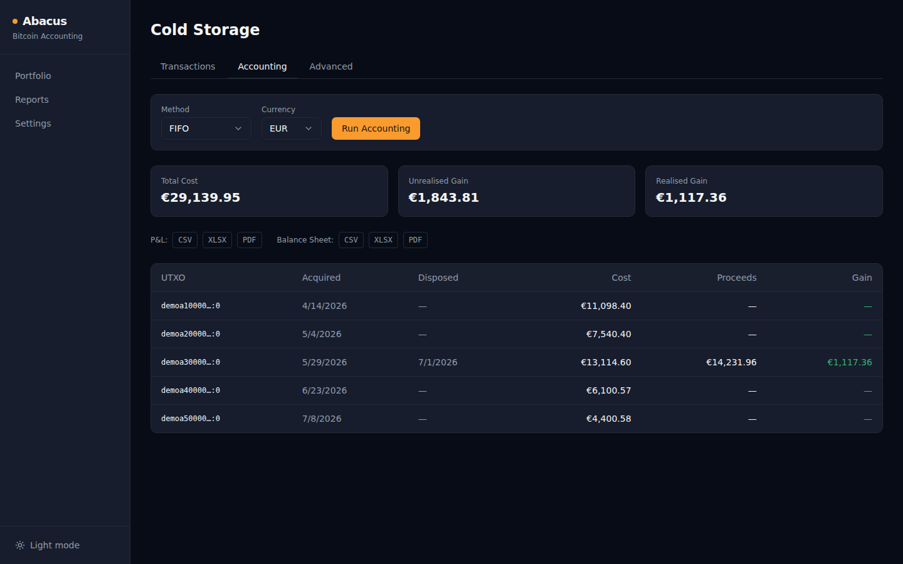
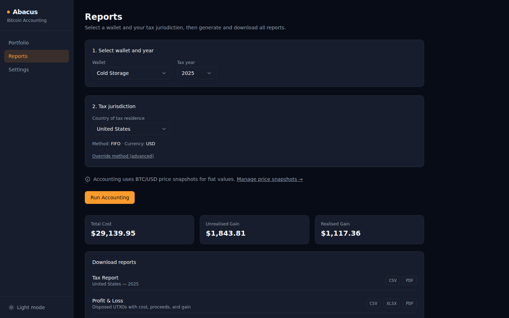
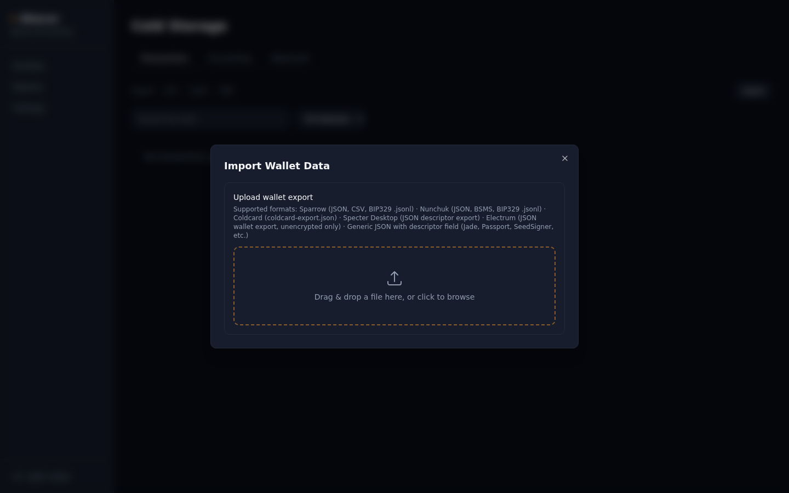
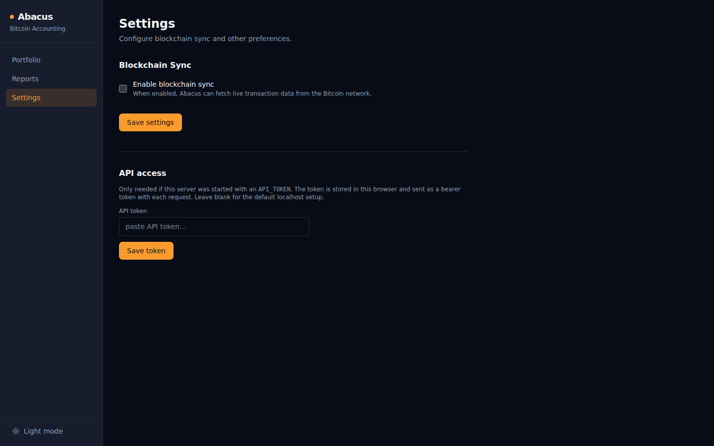

# Abacus

**Bitcoin Accounting Engine**

```
◉
│││
│││
│││
```

*Wallets manage bitcoin. Abacus manages the books.*

---

Abacus is an open-source, self-hosted Bitcoin accounting engine.
Import your wallet data and get an immutable financial ledger with multi-method cost basis accounting, blockchain sync, and jurisdiction-specific tax reports.

## Screenshots

| | |
|---|---|
|  |  |
| Portfolio dashboard — cross-wallet holdings, gains, and a value/BTC history chart | Wallet transactions — search, sort, status filter, inline category editing |
|  |  |
| Accounting — FIFO/LIFO/HIFO/etc. cost basis run with per-UTXO gain/loss | Reports — jurisdiction tax reports plus P&L, balance sheet, and transaction exports |
|  |  |
| Import — drag and drop any supported wallet or exchange export, format auto-detected | Settings — opt-in blockchain sync (Esplora/Electrum) and API token configuration |

## What Abacus does

- Imports wallet data from **Sparrow**, **Nunchuk**, **Coldcard**, **Specter Desktop**, **Electrum**, and any wallet that exports a descriptor or BIP329 labels
- Imports exchange transaction history from **Bitvavo**, **Bitonic**, **Kraken**, **Coinbase**, and **Strike** (Lightning + trades)
- Builds an **immutable ledger** from your transaction history
- Runs **FIFO, Average Cost, LIFO, HIFO, Specific ID, and UK Section 104** cost basis calculations
- Tracks **UTXO age and cost basis** per coin
- Syncs transaction history live via **Esplora, Electrum, or a self-hosted Bitcoin Core node** — opt-in, configured via the Settings page
- Generates **tax reports** for the Netherlands (Box 3), Germany (§23 EStG), United Kingdom (HMRC CGT / Section 104), and United States (IRS Form 8949)
- Generates **generic reports** (balance sheet, P&L, CSV/PDF/Excel)
- Provides a **REST API** for all accounting data
- Serves a **React dashboard** at `localhost:8080`

## What Abacus does NOT do

- Store private keys or seed phrases
- Connect to your wallet or sign transactions
- Replace Sparrow, Nunchuk, or any other wallet

## Privacy

Abacus works on **public wallet data only** (xpubs, addresses, txids) and is designed to run self-hosted and offline. It never stores or transmits keys or signing material, and encrypted Sparrow databases (`.mv.db`) are rejected outright.

Blockchain sync is **opt-in and off by default**. When enabled, syncing queries the configured Esplora/Electrum server for your wallet's addresses — disclosing them, and the fact that they belong to one wallet, to that third party. For maximum privacy, point sync at an Esplora or Electrum instance you host yourself. Sync is configured at runtime in the in-app **Settings** page (persisted in SQLite; no restart needed).

Wallet-import uploads are capped at 32 MiB.

## Securing the API

Abacus defaults to the single-user, localhost case. For deployments exposed beyond
localhost, two opt-in controls live on `/api/v1` (configured via `.env`):

- `API_TOKEN` — require `Authorization: Bearer <token>` on all routes except
  `/health` and `/version`. The bundled web UI attaches this token once you save
  it on the **Settings → API access** page (stored in the browser). Generate a
  strong value, e.g. `openssl rand -hex 32` — a short or guessable token
  defeats the auth check entirely.
- `RATE_LIMIT_RPM` — per-IP request cap per minute (default 600; `0` disables).
  Behind a reverse proxy, set `TRUST_PROXY=true` so the limiter uses the real
  client IP from `X-Forwarded-For`/`X-Real-IP` — **only** behind a trusted proxy,
  since those headers are otherwise spoofable. See `SECURITY.md`.

## Quick Start

**Docker (recommended)**
```bash
git clone https://github.com/storagebirddrop/abacus
cd abacus
cp .env.example .env
docker compose up --build
```

**AppImage (Linux, no install)**
```bash
# Download the latest release from GitHub Releases
chmod +x Abacus-*-x86_64.AppImage
./Abacus-*-x86_64.AppImage
```

Releases are signed with [cosign](https://docs.sigstore.dev/) (keyless) and ship a
`sha256sums.txt`. To verify before running:
```bash
sha256sum -c sha256sums.txt
cosign verify-blob \
  --certificate Abacus-<version>-x86_64.AppImage.pem \
  --signature  Abacus-<version>-x86_64.AppImage.sig \
  --certificate-identity-regexp 'https://github.com/storagebirddrop/Abacus/.github/workflows/release.yml@.*' \
  --certificate-oidc-issuer https://token.actions.githubusercontent.com \
  Abacus-<version>-x86_64.AppImage
```

Open http://localhost:8080

For a production deployment (exposed beyond localhost, running as a background service,
backups) see [docs/deployment.md](docs/deployment.md).

## Import your wallet

**On-chain wallets:**
1. Export your wallet data from your wallet app
2. Open Abacus → Wallets → Add Wallet → On-chain wallet
3. Drag and drop a file onto the drop zone, or click to browse — Abacus detects the format automatically

**Supported on-chain formats:**
- Sparrow JSON wallet export, transaction CSV
- Nunchuk JSON export
- Coldcard `coldcard-export.json`
- Specter Desktop JSON descriptor export
- Electrum JSON wallet export (unencrypted)
- BSMS files (BIP-129, multisig descriptor)
- BIP329 label files (`.jsonl`)
- Any JSON with a `descriptor` or `desc` field (Jade, Passport, SeedSigner, etc.)

**Exchange accounts:**
1. Export your transaction history CSV from your exchange
2. Open Abacus → Wallets → Add Wallet → Exchange account
3. Select your exchange, upload the CSV — trades are imported automatically

**Supported exchanges:**
- Bitvavo
- Bitonic
- Kraken (Ledgers CSV export)
- Coinbase (Transaction History CSV)
- Strike (Transaction History CSV, Lightning + trades)

## Architecture

```
Blockchain (Esplora / Electrum)         Exchange CSV exports
    ↓                                       ↓
Sync Layer (address derivation        Exchange Importers
    → tx fetch → persist)             (Bitvavo / Bitonic /
    ↓                                  Kraken / Coinbase /
Importer (Sparrow / Nunchuk /          Strike)
    Coldcard / Specter /                    ↓
    Electrum / BIP329 / BSMS)         ExchangeTrade records
    ↓                                       ↓
Normalization (wallet-agnostic)  ──────────┘
    ↓
Ledger Engine (immutable)
    ↓
Accounting Engine (FIFO / AvgCost / LIFO / HIFO / SpecificID / Section 104
                   + ExchangeFIFO for exchange wallets)
    ↓
Report Engine (CSV / PDF / Excel / Tax Reports)
    ↓
REST API
    ↓
Web UI
```

See [docs/architecture.md](docs/architecture.md) for the full design.

## Development

```bash
# Build frontend first (required for go:embed)
make frontend

# Backend
go build ./...
go test ./...

# Frontend dev server (proxies /api → :8080)
cd web && npm run dev

# Full stack
docker compose up --build

# AppImage (requires appimagetool)
make appimage
```

API spec: [docs/api/swagger.yaml](docs/api/swagger.yaml)

## Roadmap

| Item | Status |
|---|---|
| Phase 0 — Architecture & Foundation | ✅ |
| Phase 1 — Sparrow + Nunchuk importer | ✅ |
| Phase 2 — Ledger Engine | ✅ |
| Phase 3 — Accounting Engine (FIFO / Avg Cost) | ✅ |
| Phase 4 — Dashboard (React / Vite) | ✅ |
| Phase 5 — Reports (PDF / Excel / CSV) | ✅ |
| Phase 6 — Extended wallet importers (Coldcard, Specter, Electrum, generic) | ✅ |
| Phase 7 — Blockchain sync (Esplora / Electrum) | ✅ |
| Backlog 1 — Ledger & UTXO endpoints | ✅ |
| Backlog 5 — Jurisdiction tax reports (NL / DE / UK / US) + LIFO / HIFO / Section 104 | ✅ |
| Backlog 6 — BIP329 label export + `POST /labels` | ✅ |
| Backlog 7 — Linux AppImage packaging + GitHub Release CI | ✅ |
| Settings — UI-driven blockchain sync config (opt-in, runtime-configurable) | ✅ |
| Hardening — API auth/rate-limit + reverse-proxy IP, signed releases + checksums, Docker non-root, CI coverage gate + npm audit, server-side transaction search/sort/filter, responsive sidebar | ✅ |
| Version baked into binary at build time via ldflags | ✅ |
| Remote branch cleanup | ✅ |
| Signed AppImage releases — see [Releases](https://github.com/storagebirddrop/Abacus/releases) for the latest | ✅ |
| Drag-and-drop import zone in the UI | ✅ |
| Exchange account imports (Bitvavo, Bitonic, Kraken, Coinbase, Strike) | ✅ |
| Multisig blockchain sync (`wsh(sortedmulti(...))`/`wsh(multi(...))`, up to 16-of-16) | ✅ |
| CoinGecko auto price-fetch (`POST /prices/fetch`) | ✅ |
| Portfolio dashboard (cross-wallet home screen) | ✅ |
| UX workflow overhaul (transactions, accounting, reports, onboarding) | ✅ |
| Automated semver release on every `feat`/`fix` merge to `main` | ✅ |
| Post-launch review pass — CI auto-release race, multisig OP_N bounds check, exchange-import dedup + currency bugs, unrealised-gain calculation | ✅ |
| Dark-first design system — real theming (dark and light both fully token-based, not just a background swap), single accent color, portfolio value/BTC-holdings history chart on the dashboard | ✅ |
| Governance & onboarding docs — CODE_OF_CONDUCT, production deployment guide, README screenshots (Portfolio, Transactions, Accounting, Reports, Import, Settings) | ✅ |
| Accessibility audit (aria attributes, keyboard navigation) | ✅ |
| Bitcoin Core sync backend | ✅ |

## Community

Contributions welcome — see [CONTRIBUTING.md](CONTRIBUTING.md). This project follows the
[Contributor Covenant Code of Conduct](CODE_OF_CONDUCT.md).

## License

MIT
